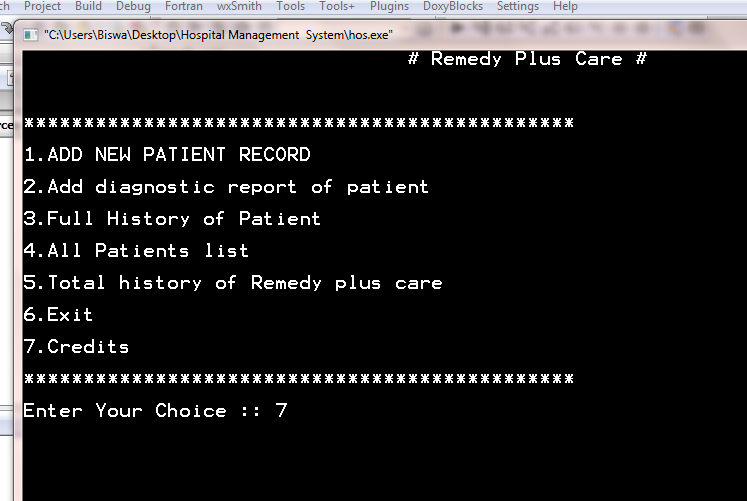

# HospitalManagementSystem-C-PROJECT :star_struck: :open_file_folder: :computer: :closed_book:

 
 

***This new Hospital Management System using C is created by Biswarup Bhattacharjee, student of BTECH, in University of Engineering and Management, Kolkata.***

**Email Id: bbiswa471@gmail.com.** 

**Contact No: 916290272740.** 

## About :point_down: 

 

## Purpose :point_down:

## Use :point_down:

 

## Folder Structure :point_down:

## Making :point_down:

    
## Screenshots :point_down: 

 

 

 

 

 

 

 

 

 

 

 

 

 

 

 

 

 

 

