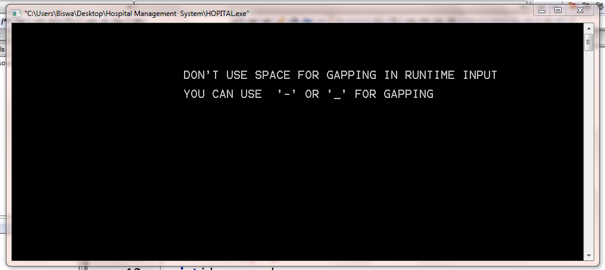
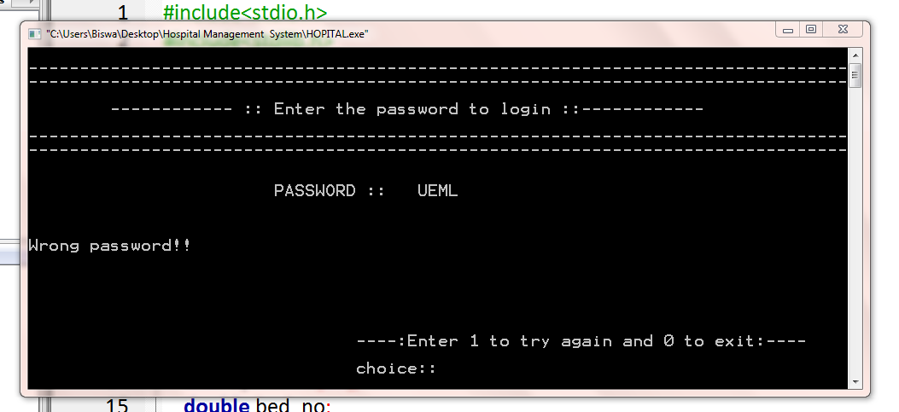

# HospitalManagementSystem-C-PROJECT :star_struck: :open_file_folder: :computer: :closed_book:

 
 

***This new Hospital Management System using C is created by Biswarup Bhattacharjee, student of BTECH, in University of Engineering and Management, Kolkata.***

**Email Id: bbiswa471@gmail.com.** 

**Contact No: 916290272740.** 

## About :point_down: 

 
The project HOSPITAL MANAGEMENT SYSTEM is used for keeping record of each and every patients of hospital in a database format. Usually, this system is handled by receptionists, record managers. It is confidential and cannot be opened by others. When a patient is admitted, his details should be recorded by hospital management system. All diagnostic reports of a patient should be kept carefully. Full history of a patient should be kept carefully for proper thorough treatment. All patient list must be there for perfect procedure of treatment. So, the unoccupied rooms and beds can be given to new patients. When patient is discharged from hospital then the total fees and treatment cost is given to him for payment. The records of the patients are kept confidentially. I have created a program hospital.c. I ahve used structure, array, pointers, if else, switch case, while loop, do while loop and file handling. I have designed the output screen in various ways. I have used file as a database for this project. This system can be modified and also can be deployed.

## Purpose :point_down:

I have created it in for my first sem project. I have practiced file handling concepts in C and got a basic idea of management systems.

## Folder Structure :point_down:

Hospital Management System
         hospital.c
    
## Screenshots of this project :point_down: 

 

 

 

 

 

 

 

 

 

 

 

 

 

 

 

 

 

 

